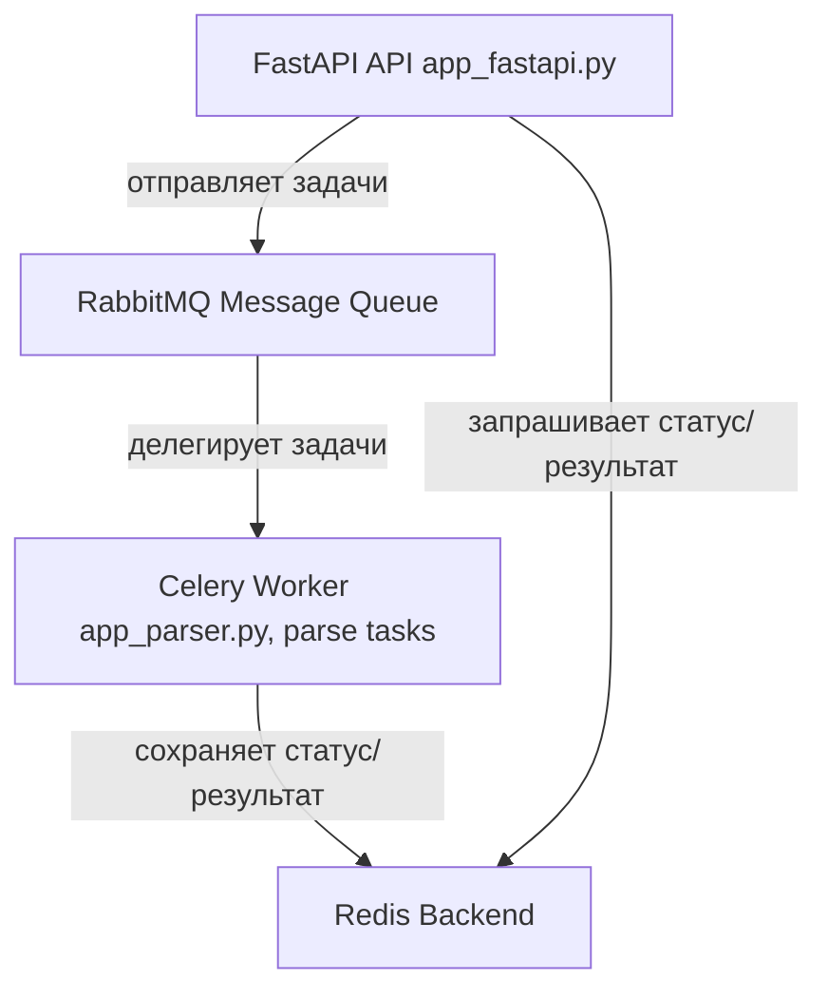

# Rostender Tenders Parser

<p align="center">
  
</p>

Парсер тендеров с сайта rostender.info с асинхронной обработкой задач через Celery и веб-интерфейсом на FastAPI.

## Описание

Проект позволяет автоматически собирать и парсить данные тендеров с сайта rostender.info, сохранять их в CSV, а через HTTP REST API получать данные или запускать новую задачу парсинга.

Основные компоненты:

- **Парсер тендеров**: собирает ссылки на тендеры, парсит их детали и сохраняет в файле `tenders.csv`.
- **Celery worker**: выполняет задачи парсинга асинхронно через очередь сообщений RabbitMQ.
- **FastAPI**: REST API для запуска задач и просмотра данных и статусов.
- **RabbitMQ**: брокер сообщений для очередей Celery.
- **Redis**: backend для хранения результатов задач Celery.

## Установка и запуск

### Требования

- Docker и Docker Compose
- Порты 8000, 5672, 15672 и 6379 свободны для работы

### Запуск

1. Клонируйте репозиторий и перейдите в каталог проекта:

```bash
git clone https://github.com/metanovus/eksima_test
cd eksima_test
```

2. Для поднятия всех сервисов (RabbitMQ, Redis, worker, FastAPI) выполните:

```bash
docker-compose up --build
```

3. Выполнение первичной задачи парсинга (парсинг 100 тендеров):

```bash
docker exec -it название_контейнера_worker sh  # (название_контейнера_worker - например, "eksima_test-worker-1")
python app_parser.py --max 100 --output tenders.csv
```

4. Работа в UI-интерфейсе на FastAPI (http://localhost:8000/):
  - в поле "Запустить парсинг" вбейте значение (от 1) - число тендеров для парсинга
  - нажмите "Старт"
  - чтобы интерактивно посмотреть результаты последнего парсинга, нажмите на кнопку "Загрузить тендеры"
  - все результаты парсинга сохраняются в файле tenders.csv на диске

5. Работа с сервисом вне Docker
  - после клонирования репозитория просто выполните команду 
```bash
python app_parser.py --max ЧИСЛО --output tenders.csv
```

## REST API

Данные методы можно выполнять в Desktop-версии Postman в том числе:

- `GET /tenders/` — получить текущие данные тендеров из файла CSV.
- `POST /parse/?max=N` — запустить парсинг N последних тендеров (по умолчанию 10). Возвращает task_id.
- `GET /status/{task_id}` — получить статус и результат задачи парсинга по task_id.

## Настройки

Переменные окружения (логины/пароли, адреса сервисов) находятся в `docker-compose.yml`:

- `RABBITMQ_URL` — URL RabbitMQ для брокера Celery.
- `REDIS_URL` — URL Redis для бэкенда Celery.
- `SERVICE_TYPE` — тип сервиса для логирования (задается при запуске).

## Архитектура и пайплайн

### Архитектура



## Логирование

- Логи пишутся в папку `logs`, с ротацией по 10MB.
- В консоль выводится с уровнем INFO.
- Разделение логов по типу сервиса (worker, fastapi и т.д.) через переменную окружения SERVICE_TYPE.

## Разработка

- Код работает на Python 3.10.
- Небольшой фронтенд написан на HTML + JavaScript.
- Основные зависимости указаны в `requirements.txt`.
- Используется Celery для задач, FastAPI для REST API.
- Парсер написан с использованием requests, BeautifulSoup, регулярных выражений и tenacity для повторных попыток.

## Возможные улучшения

- Дополнительные воркеры в дальнейшем при расширении функционала парсера
- Подключение SQLite или MySQL базы данных при расширении функционала
- Организация окружения в файле `.env` с определением переменных (например, порты или URL-адрес для брокера сообщений) в файле и в SQLite или MySQL базе данных
- Добавление API-методов (например, при работе с сайтом `https://www.b2b-center.ru/market/` есть SOAP API методы, но они доступны только после регистрации)
- Парсинг в том числе сайта `https://www.b2b-center.ru/market/` (основная причина, по которой первично выбран сайт Ростендер - сайт B2B-Center не позволяет без регистрации переходить на вторую страницу, API-методы для перехода не определяются)
- Улучшение интерфейса (если будет задача в дальнейшем улучшать интерфейс для конечного пользователя)